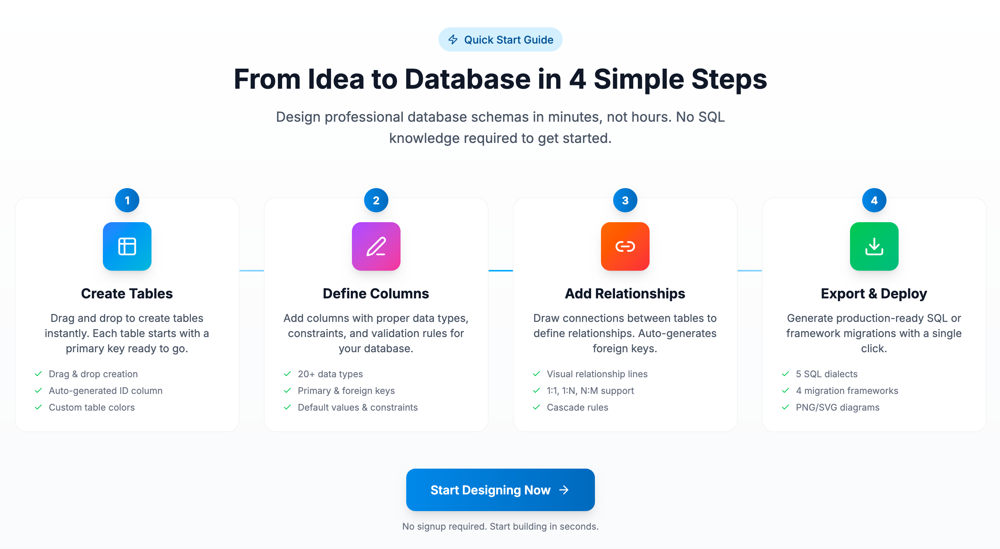

  

<h1 align="center">Skemato</h1>

  <strong>Visual Database Schema Designer</strong> 
  Design your database visually. Export to SQL. Generate migrations.

  <a href="https://skemato.com">Website</a> •
  <a href="https://skemato.com/designer">Try Free</a> •
  <a href="https://skemato.com/docs">Documentation</a> •
  <a href="https://skemato.com/blog">Blog</a>

  
  
  
  

---

## What is Skemato?

Skemato is a **free online database schema designer** that lets you create Entity Relationship Diagrams (ERD) with an intuitive drag-and-drop interface. Design your database visually, define relationships between tables, and export production-ready SQL for any major database system.

**No installation required** — works directly in your browser.

  

---

## Key Features

### Visual Database Designer
Create tables with drag-and-drop. Define columns, data types, primary keys, foreign keys, and constraints — all visually.

  

### 5 SQL Dialects
Export your schema to any major database:
- **MySQL**
- **PostgreSQL**
- **SQLite**
- **SQL Server**
- **Oracle**

  

### 4 Migration Frameworks
Generate ready-to-use migration files for popular frameworks:
- **Laravel** (PHP)
- **Django** (Python)
- **Prisma** (TypeScript/Node.js)
- **TypeORM** (TypeScript)

### AI-Powered Design
Describe your application in plain English and let AI create the database schema for you.

> "I need a database for an e-commerce app with products, categories, and orders"

  

### Data Browser & Generator
View, edit, and generate realistic fake data for your tables. Export data as SQL INSERT statements or CSV.

  

### Cloud Sync
Sign in with Google to save your projects to the cloud. Access your schemas from any device, anytime.

---

## How It Works

  

1. **Create Tables** — Drag and drop to create tables instantly
2. **Define Columns** — Add columns with proper data types and constraints
3. **Add Relationships** — Draw connections between tables to define foreign keys
4. **Export & Deploy** — Generate SQL or framework migrations with one click

---

## Export Formats

| Format | Description |
|--------|-------------|
| **SQL** | CREATE TABLE statements with constraints and indexes |
| **PNG** | High-quality diagram image for documentation |
| **SVG** | Scalable vector graphic |
| **JSON** | Complete project file for backup/sharing |
| **Migrations** | Framework-specific migration files |

---

## Pricing

| Plan | Price | Projects | Tables | Features |
|------|-------|----------|--------|----------|
| **Free** | $0 | 1 | 10 | SQL export, Cloud sync |
| **Pro** | $15/mo | 5 | 50 | + PNG/JSON exports, AI data generation |
| **Max** | $29/mo | 15 | 200 | + AI Assistant, All exports, SVG, Migrations |

**No credit card required** for the free plan. [Start designing now →](https://skemato.com/designer)

---

## Supported Languages

Skemato is available in 7 languages:

- English
- Español (Spanish)
- Deutsch (German)
- Русский (Russian)
- 中文 (Chinese)
- العربية (Arabic)
- हिन्दी (Hindi)

---

## Resources

- [Documentation](https://skemato.com/docs) — Complete user guide
- [Blog](https://skemato.com/blog) — Database design tutorials and best practices
- [FAQ](https://skemato.com/#faq) — Frequently asked questions

### Popular Blog Articles
- [Database Schema Design: Complete Guide](https://skemato.com/blog/database-schema-design-complete-guide-2025)
- [MySQL vs PostgreSQL Comparison](https://skemato.com/blog/mysql-vs-postgresql-comparison-2025)
- [How to Create ERD Diagrams](https://skemato.com/blog/entity-relationship-diagram-tutorial)
- [Database Normalization Explained](https://skemato.com/blog/database-normalization-guide-1nf-2nf-3nf)

---

## Contact & Support

- **Email**: contactskemato@gmail.com
- **Website**: [skemato.com](https://skemato.com)
- **Contact Form**: [skemato.com/#contact](https://skemato.com/#contact)

---

## Legal

- [Privacy Policy](https://skemato.com/privacy)
- [Terms of Service](https://skemato.com/terms)

---

  Made with care by <a href="https://www.linkedin.com/in/youssef-hajaj/">Youssef Hajaj</a>

  

