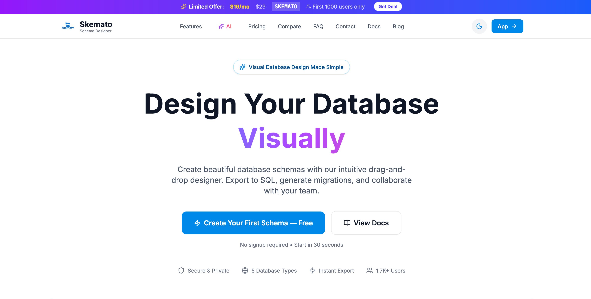
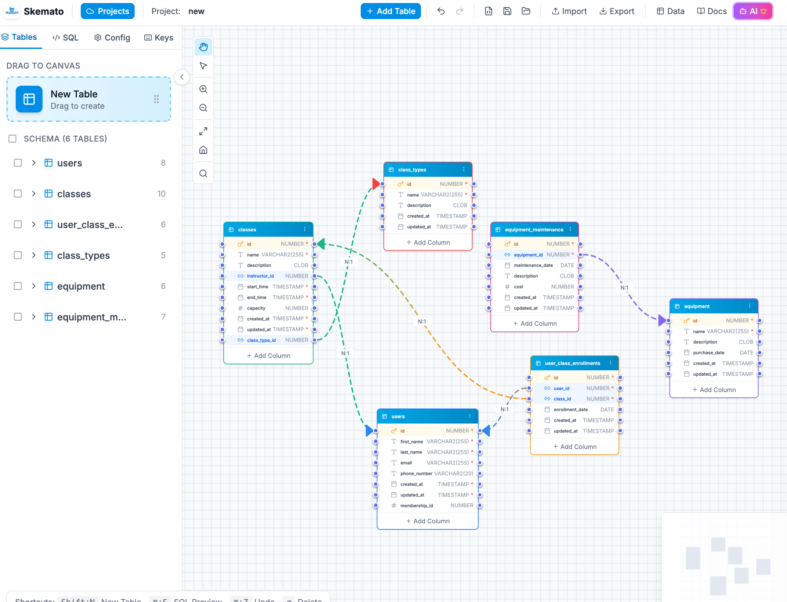
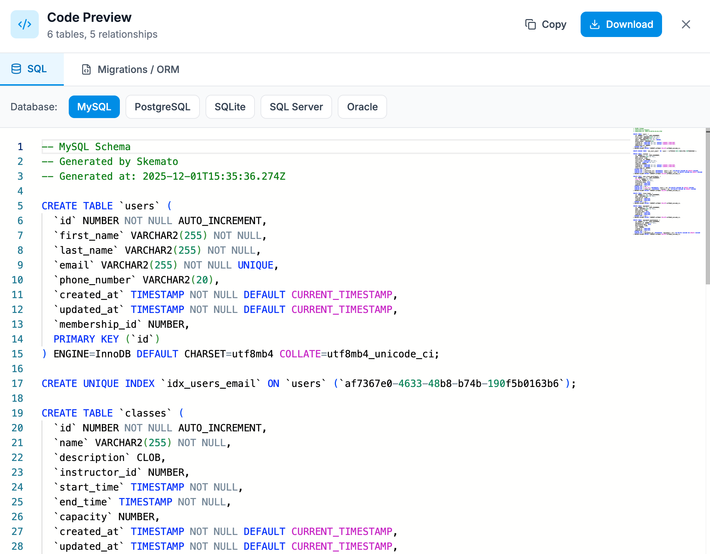
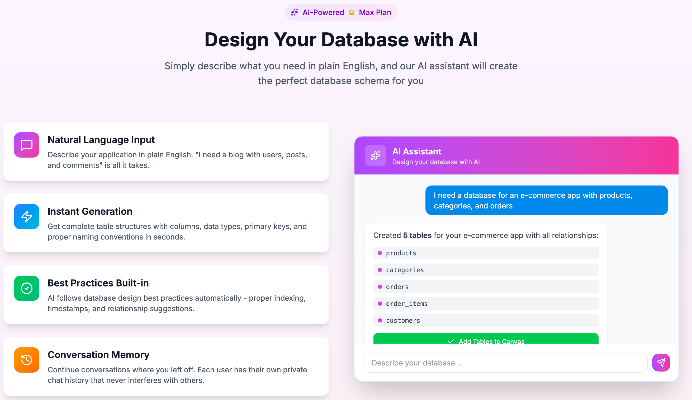
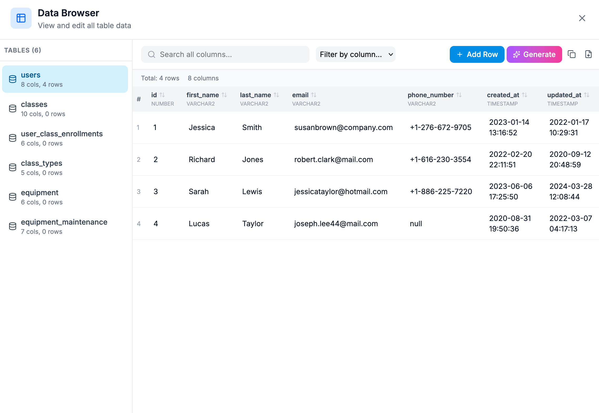

<div align="center">

<!-- Animated Header -->


<!-- Logo -->


<!-- Tagline -->
<h3>Design databases visually. Export to SQL. Generate migrations.</h3>

<!-- Badges Row 1 -->
<p>
  <a href="https://skemato.com"></a>
  <a href="https://skemato.com/designer"></a>
  <a href="https://skemato.com/docs"></a>
</p>

<!-- Badges Row 2 -->
<p>
  
  
  
  
  
</p>

<br/>

<!-- Hero Screenshot -->


<br/><br/>

<!-- Quick Links -->
<a href="https://skemato.com/designer"></a>

</div>

---

## 🎯 What is Skemato?

**Skemato** is a powerful, free online database schema designer that transforms how developers design databases. Create beautiful Entity Relationship Diagrams (ERD) with an intuitive drag-and-drop interface, define relationships visually, and export production-ready code instantly.

<table>
<tr>
<td width="50%">

### ✨ Why Skemato?

- 🎨 **Visual First** — No more writing CREATE TABLE by hand
- ⚡ **Instant Export** — SQL code generated in real-time
- 🤖 **AI Powered** — Describe your app, get a database
- ☁️ **Cloud Sync** — Access from anywhere
- 🆓 **Free Forever** — No credit card required

</td>
<td width="50%">

### 🎯 Perfect For

- 👨‍💻 **Developers** — Speed up your workflow
- 🎓 **Students** — Learn database design visually
- 🏢 **Teams** — Collaborate on schema design
- 🚀 **Startups** — Prototype databases quickly
- 📊 **Architects** — Document existing systems

</td>
</tr>
</table>

---

## 🖥️ The Visual Designer

Design your database schema with our intuitive drag-and-drop canvas. Create tables, define columns, and connect relationships — all without writing a single line of SQL.

<div align="center">

</div>

<br/>

<table>
<tr>
<td align="center" width="25%">
<br/>
<sub>Drag & drop to create</sub>
</td>
<td align="center" width="25%">
<br/>
<sub>20+ data types</sub>
</td>
<td align="center" width="25%">
<br/>
<sub>1:1, 1:N, N:M</sub>
</td>
<td align="center" width="25%">
<br/>
<sub>One-click deploy</sub>
</td>
</tr>
</table>

---

## 🗄️ 5 Database Dialects

Export your schema to any major database system with dialect-specific syntax, proper data types, and optimized code.

<div align="center">

| | Database | Status | Features |
|:---:|:---|:---:|:---|
|  | **MySQL** | ✅ Full Support | InnoDB, charset, collation |
|  | **PostgreSQL** | ✅ Full Support | SERIAL, UUID, JSONB |
|  | **SQLite** | ✅ Full Support | Lightweight, embedded |
|  | **SQL Server** | ✅ Full Support | IDENTITY, NVARCHAR |
|  | **Oracle** | ✅ Full Support | NUMBER, VARCHAR2 |

</div>

<br/>

<div align="center">

</div>

---

## 🔧 4 Migration Frameworks

Generate production-ready migration files for your favorite framework. Just select your framework and download.

<div align="center">

| Framework | Language | File Generated |
|:---:|:---|:---|
|  | PHP | `database/migrations/*.php` |
|  | Python | `models.py` with Django ORM |
|  | TypeScript | `schema.prisma` |
|  | TypeScript | Entity classes with decorators |

</div>

---

## 🤖 AI-Powered Database Design

Simply describe your application in plain English, and our AI assistant will design the perfect database schema for you.

<div align="center">

</div>

<br/>

<div align="center">

```
💬 "I need a database for an e-commerce app with products, categories, and orders"

✨ AI generates: products, categories, orders, order_items, customers
   with all relationships and proper data types!
```

</div>

<table>
<tr>
<td width="50%">

### 🧠 AI Features

- **Natural Language** → Describe in plain English
- **Instant Generation** → Tables created in seconds
- **Best Practices** → Follows DB design patterns
- **Conversation Memory** → Refine with follow-ups

</td>
<td width="50%">

### 💡 Example Prompts

- *"Create a blog with users, posts, and comments"*
- *"Design a school management system"*
- *"I need tables for a social media app"*
- *"Add soft deletes to all tables"*

</td>
</tr>
</table>

---

## 📊 Data Browser & Generator

View, edit, and generate realistic fake data for testing. Export your data as SQL INSERT statements or CSV files.

<div align="center">

</div>

<br/>

<div align="center">

| Feature | Description |
|:---:|:---|
| 👁️ **View Data** | Browse all your table data in one place |
| ✏️ **Edit Inline** | Click any cell to edit directly |
| 🎲 **Generate Fake Data** | AI-powered realistic data generation |
| 📤 **Export** | SQL INSERT or CSV download |

</div>

---

## 📦 Export Formats

<div align="center">

| Format | Extension | Use Case | Plan |
|:---:|:---:|:---|:---:|
| 📄 **SQL** | `.sql` | Database deployment | Free |
| 🖼️ **PNG** | `.png` | Documentation, presentations | Pro |
| 🎨 **SVG** | `.svg` | Scalable diagrams | Max |
| 📋 **JSON** | `.json` | Backup, version control | Pro |
| 📊 **CSV** | `.csv` | Data export | Max |
| 🔄 **Migrations** | `.php/.py/.ts` | Framework integration | Max |

</div>

---

## 💎 Pricing

<div align="center">

| | Free | Pro | Max |
|:---|:---:|:---:|:---:|
| **Price** | **$0** | **$15**/mo | **$29**/mo |
| Projects | 1 | 5 | 15 |
| Tables per project | 10 | 50 | 200 |
| Visual Designer | ✅ | ✅ | ✅ |
| All SQL Dialects | ✅ | ✅ | ✅ |
| Cloud Sync | ✅ | ✅ | ✅ |
| SQL Export | ✅ | ✅ | ✅ |
| PNG Export | ❌ | ✅ | ✅ |
| JSON Export | ❌ | ✅ | ✅ |
| SVG Export | ❌ | ❌ | ✅ |
| Framework Migrations | ❌ | ❌ | ✅ |
| AI Data Generation | ❌ | ✅ | ✅ |
| **AI Assistant** | ❌ | ❌ | ✅ |
| | [Start Free](https://skemato.com/designer) | [Get Pro](https://skemato.com/#pricing) | [Get Max](https://skemato.com/#pricing) |

</div>

<br/>

<div align="center">

> 💡 **No credit card required** for the free plan. Start designing immediately!

</div>

---

## 🛠️ Tech Stack

<div align="center">

### Frontend


### Backend & API


### Database & Caching


### AI & Machine Learning


### Authentication & Payments


### DevOps & Infrastructure


</div>

---

## 🏗️ Architecture Highlights

<div align="center">

| Component | Technology | Description |
|:---:|:---|:---|
| 🎨 **UI Framework** | React 18 + Vite | Fast, modern frontend with HMR |
| 🔄 **State Management** | Zustand | Lightweight state with persistence |
| 📊 **Visual Canvas** | React Flow | Interactive node-based diagrams |
| 🌐 **Internationalization** | i18next | 7 languages with RTL support |
| ⚡ **API Framework** | FastAPI (Async) | High-performance Python API |
| 🗄️ **ORM** | SQLAlchemy 2.0 | Async database operations |
| ✅ **Validation** | Pydantic V2 | Data validation & serialization |
| 💾 **Caching** | Redis | Rate limiting & response caching |
| 🔐 **Auth** | Google OAuth 2.0 + JWT | Secure token-based authentication |
| 💳 **Payments** | LemonSqueezy | Subscription management & webhooks |
| 🤖 **AI** | Google Gemini API | Natural language schema generation |
| 📧 **Email** | SMTP (Async) | Transactional emails |

</div>

---

## 💳 Payment System

Secure subscription management powered by **LemonSqueezy**.

<div align="center">

| Feature | Description |
|:---:|:---|
| 💰 **Flexible Plans** | Free, Pro ($15/mo), Max ($29/mo) |
| 🔄 **Subscription Management** | Upgrade, downgrade, cancel anytime |
| 🌍 **Global Payments** | Credit cards, PayPal, local methods |
| 🔐 **PCI-DSS Compliant** | Secure payment processing |
| 📧 **Email Notifications** | Welcome, renewal, expiration alerts |
| 🔗 **Webhook Integration** | Real-time subscription updates |
| 🧾 **Instant Access** | Features unlock immediately |

</div>

### Webhook Events Handled

```
✅ subscription_created    → Welcome email + tier upgrade
✅ subscription_updated    → Plan change processed
✅ subscription_cancelled  → Downgrade scheduled
✅ payment_success         → Renewal confirmation
✅ payment_failed          → Recovery notification
```

---

## 🌍 Available in 7 Languages

<div align="center">

| | Language | Code |
|:---:|:---|:---:|
| 🇺🇸 | English | `en` |
| 🇪🇸 | Español (Spanish) | `es` |
| 🇩🇪 | Deutsch (German) | `de` |
| 🇷🇺 | Русский (Russian) | `ru` |
| 🇨🇳 | 中文 (Chinese) | `zh` |
| 🇸🇦 | العربية (Arabic) | `ar` |
| 🇮🇳 | हिन्दी (Hindi) | `hi` |

</div>

---

## 📚 Resources & Learning

<div align="center">

| Resource | Description |
|:---|:---|
| 📖 [Documentation](https://skemato.com/docs) | Complete user guide and tutorials |
| 📝 [Blog](https://skemato.com/blog) | Database design best practices |
| ❓ [FAQ](https://skemato.com/#faq) | Frequently asked questions |
| 📧 [Contact](https://skemato.com/#contact) | Get in touch with support |

</div>

### 📰 Popular Articles

- 📘 [Database Schema Design: The Complete Guide](https://skemato.com/blog/database-schema-design-complete-guide-2025)
- 🔄 [MySQL vs PostgreSQL: Which to Choose?](https://skemato.com/blog/mysql-vs-postgresql-comparison-2025)
- 📊 [How to Create ERD Diagrams](https://skemato.com/blog/entity-relationship-diagram-tutorial)
- 🗂️ [Database Normalization (1NF, 2NF, 3NF)](https://skemato.com/blog/database-normalization-guide-1nf-2nf-3nf)
- ⚡ [Database Indexing Strategies](https://skemato.com/blog/database-indexing-performance-guide)

---

## 🔒 Security & Privacy

Built with security-first mindset following **OWASP Top 10** guidelines.

<div align="center">

| | Security Feature | Implementation |
|:---:|:---|:---|
| 🔐 | **SSL/TLS Encryption** | All data encrypted in transit (HTTPS) |
| 🛡️ | **OWASP Top 10 Compliant** | Protection against common vulnerabilities |
| 🚫 | **XSS Prevention** | Input sanitization with Bleach library |
| 🔑 | **SQL Injection Protection** | Parameterized queries via SQLAlchemy ORM |
| ⏱️ | **Rate Limiting** | 100 requests/minute per IP (Redis-backed) |
| 🔒 | **JWT Authentication** | Secure token-based sessions (HS256) |
| 👤 | **Google OAuth 2.0** | No password storage, secure SSO |
| 🛑 | **CORS Protection** | Strict origin validation |
| 📋 | **Security Headers** | X-Frame-Options, CSP, HSTS enabled |
| 📦 | **Request Size Limits** | DoS protection (10MB max) |
| 🔏 | **Webhook Verification** | HMAC-SHA256 signature validation |
| 🗄️ | **Data Ownership** | Export anytime, delete anytime |

</div>

### 🛡️ OWASP Protections

<table>
<tr>
<td width="50%">

**Injection (A03:2021)**
- SQLAlchemy ORM for parameterized queries
- Input validation with Pydantic
- HTML entity escaping

**Broken Authentication (A07:2021)**
- Google OAuth 2.0 integration
- JWT with secure signing
- Token expiration handling

</td>
<td width="50%">

**Security Misconfiguration (A05:2021)**
- Production security checks at startup
- Secure default configurations
- CORS whitelist validation

**Rate Limiting & DoS Protection**
- Redis-backed sliding window
- IP-based request throttling
- Automatic IP blocking for abuse

</td>
</tr>
</table>

---

## 📞 Contact & Support

<div align="center">

<a href="mailto:contactskemato@gmail.com"></a>
<a href="https://skemato.com/#contact"></a>
<a href="https://www.linkedin.com/in/youssef-hajaj/"></a>

</div>

---

## 📜 Legal

<div align="center">

[Privacy Policy](https://skemato.com/privacy) • [Terms of Service](https://skemato.com/terms)

</div>

---

<div align="center">

### ⭐ Star this repo if you find Skemato useful!

<br/>

<a href="https://skemato.com/designer">
  
</a>

<br/><br/>

**Made with ❤️ by [Youssef Hajaj](https://www.linkedin.com/in/youssef-hajaj/)**

<br/>


</div>
